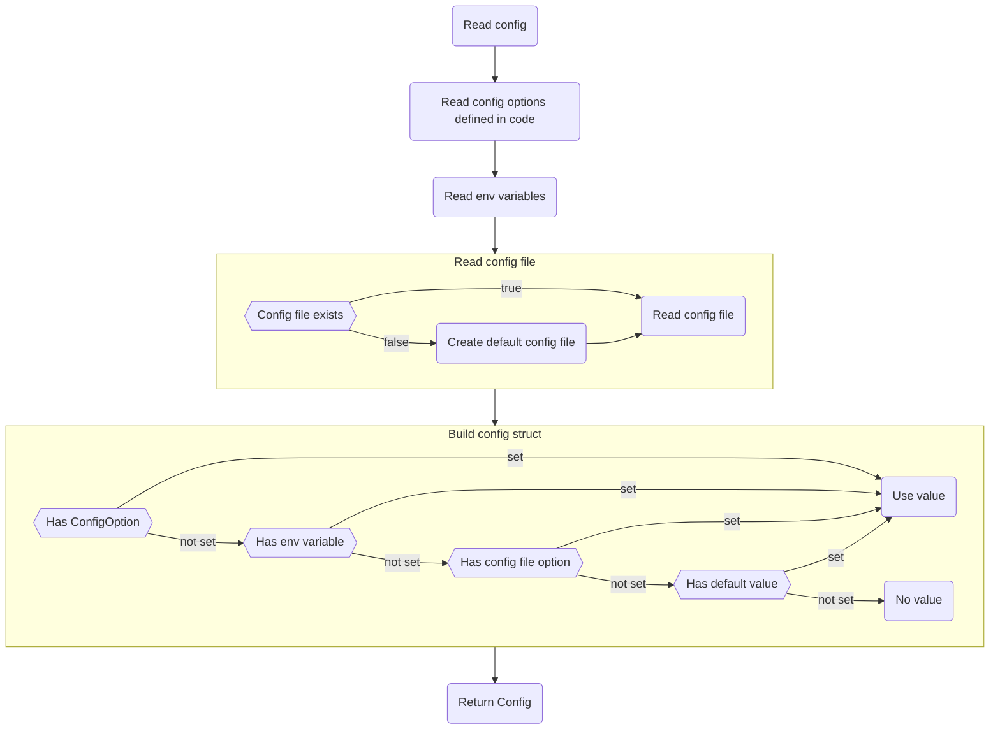

<!-- markdownlint-disable line-length html -->
<h1 align="center">
   <picture>
      <source media="(prefers-color-scheme: dark)" srcset="https://github.com/nobl9/nobl9-go/assets/48822818/caa6dfd0-e4b7-4cc5-b565-b867e23988ec">
      <source media="(prefers-color-scheme: light)" srcset="https://github.com/nobl9/nobl9-go/assets/48822818/4b0288bf-28ec-4435-af42-1d8918c81a47">
      
   </picture>
</h1>

<div align="center">
  <table>
    <tr>
      <td>
        
      </td>
      <td>
        
      </td>
      <td>
        
      </td>
    </tr>
  </table>
</div>
<!-- markdownlint-enable line-length html -->

[Nobl9](https://www.nobl9.com/) SDK for the Go programming language.

Checkout [release notes](https://github.com/nobl9/nobl9-go/releases)
for details on the latest bug fixes, updates, and features.

⚠️ Until v1.0.0 is released, we expect some minor breaking API changes
to be introduced.

---

Legend:

1. [Installation](#installation)
2. [Examples](#examples)
3. [Usage](#usage)
4. [Repository structure](#repository-structure)
5. [Contributing](#contributing)

# Installation

To add the latest version to your Go module run:

```shell
go get github.com/nobl9/nobl9-go
```

# Examples

## Basic usage

<!-- markdownlint-disable MD013 -->

```go
package main

import (
	"context"
	"encoding/json"
	"fmt"
	"log"

	"github.com/nobl9/nobl9-go/manifest"
	"github.com/nobl9/nobl9-go/manifest/v1alpha"
	"github.com/nobl9/nobl9-go/manifest/v1alpha/project"
	"github.com/nobl9/nobl9-go/manifest/v1alpha/service"
	"github.com/nobl9/nobl9-go/sdk"
	objectsV2 "github.com/nobl9/nobl9-go/sdk/endpoints/objects/v2"
)

func main() {
	ctx := context.Background()

	// Create client.
	client, err := sdk.DefaultClient()
	if err != nil {
		log.Fatalf("failed to create sdk client, err: %v", err)
	}

	// Read from file, url or glob pattern.
	objects, err := sdk.ReadObjects(ctx, "./project.yaml")
	if err != nil {
		log.Fatalf("failed to read project.yaml file, err: %v", err)
	}
	// Use manifest.FilterByKind to extract specific objects from the manifest.Object slice.
	myProject := manifest.FilterByKind[project.Project](objects)[0]
	// Define objects in code.
	myService := service.New(
		service.Metadata{
			Name:        "my-service",
			DisplayName: "My Service",
			Project:     myProject.GetName(),
			Labels: v1alpha.Labels{
				"team":   []string{"green", "orange"},
				"region": []string{"eu-central-1"},
			},
		},
		service.Spec{
			Description: "Example service",
		},
	)
	objects = append(objects, myService)

	// Verify the objects.
	if errs := manifest.Validate(objects); len(errs) > 0 {
		log.Fatalf("service validation failed, errors: %v", errs)
	}

	// Apply the objects.
	if err = client.Objects().V2().Apply(ctx, objectsV2.ApplyRequest{Objects: objects}); err != nil {
		log.Fatalf("failed to apply objects, err: %v", err)
	}

	// Get the applied resources.
	services, err := client.Objects().V1().GetV1alphaServices(ctx, objectsV1.GetServicesRequest{
		Project: myProject.GetName(),
		Names:   []string{myService.GetName()},
	})
	if err != nil {
		log.Fatalf("failed to get services, err: %v", err)
	}
	projects, err := client.Objects().V1().GetV1alphaProjects(ctx, objectsV1.GetProjectsRequest{
		Names: []string{myProject.GetName()},
	})
	if err != nil {
		log.Fatalf("failed to get projects, err: %v", err)
	}

	// Aggregate objects back into manifest.Objects slice.
	appliedObjects := make([]manifest.Object, 0, len(services)+len(projects))
	for _, service := range services {
		appliedObjects = append(appliedObjects, service)
	}
	for _, project := range projects {
		appliedObjects = append(appliedObjects, project)
	}

	// Print JSON representation of these objects.
	data, err := json.MarshalIndent(appliedObjects, "", "  ")
	if err != nil {
		log.Fatalf("failed to marshal objects, err: %v", err)
	}
	fmt.Println(string(data))

	// Delete resources.
	if err = client.Objects().V2().Delete(ctx, objectsV2.DeleteRequest{Objects: objects}); err != nil {
		log.Fatalf("failed to delete objects, err: %v", err)
	}
}
```

<!-- markdownlint-enable MD013 -->

# Usage

## Reading configuration

In order for `sdk.Client` to work, it needs to be configured.
The configuration can be read from a file, environment variables,
code options or a combination of these.

The precedence of the configuration sources is as follows
(starting from the highest):

- Code options
- Environment variables
- Configuration file
- Default values

The following flowchart illustrates the process of reading the configuration:



## Testing code relying on nobl9-go

Checkout [these instructions](./docs/mock_example/README.md)
along with a working example for recommendations on mocking `sdk.Client`.

# Repository structure

## Public packages

1. [sdk](./sdk) defines:

    - `Client` which exposes methods for interacting with
      different Nobl9 web APIs.
    - Methods for reading and managing Nobl9
      configuration (including the `config.toml` file) used by tools
      such as `sloctl` or the SDK itself.
    - Methods for fetching and parsing Nobl9 configuration objects.

2. [manifest](./manifest) holds definitions of all Nobl9 configuration
   objects, such as SLO or Project. It is divided into three package
   levels:

   ```text
   └── manifest
       └── version (e.g. v1alpha)
           └── object (e.g. slo)
   ```

    - [manifest](./manifest) defines general contracts and generic methods
      for all objects.
    - Version-specific packages, such as [v1alpha](./manifest/v1alpha), define
      version-specific APIs, functions and structures shared by multiple
      objects.
    - Object-specific packages, like [slo](./manifest/v1alpha/slo), provide
      object definition for specific object versions.

## Internal packages

1. [tests](./tests) contains the end-to-end tests code.
   These tests are run directly against a Nobl9 platform.
2. [internal](./internal) holds internal packages that are not meant to be
   exposed as part of the library's API.

# Contributing

Checkout both [contributing guidelines](./docs/CONTRIBUTING.md) and
[development instructions](./docs/DEVELOPMENT.md).
